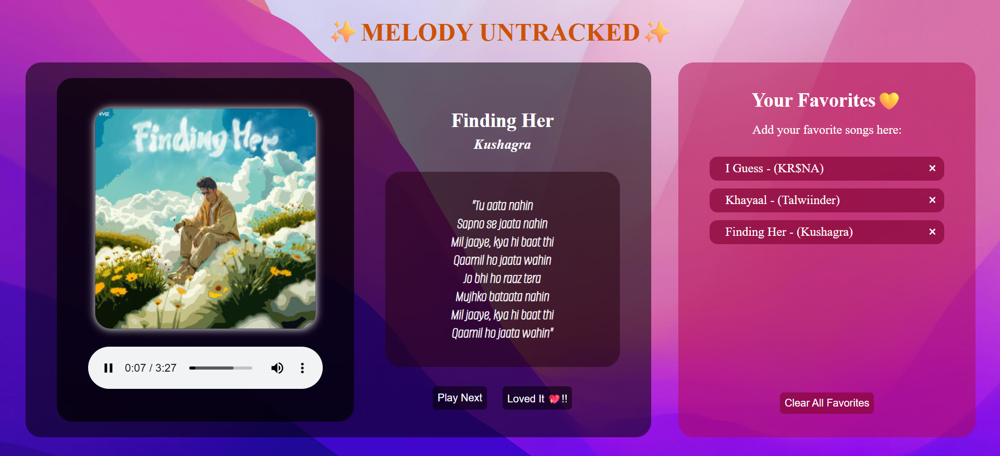

# ✨ Melody Untracked ✨  
A playful and immersive music experience that randomly serves lyrical vibes, lets you groove to tunes, and store your musical crushes — all in one interactive web app!

## 🌟 Concept  
**Melody Untracked** is a dynamic and fun project that lets users:
- 🎧 Play a random song with matching cover art
- 📝 View highlighted lyrics in aesthetic style
- 💖 Add favorite songs to a personal list
- 🔁 Enjoy a vibrating album effect synced with the music

## 🎨 Technologies Used  
- **HTML5** – Structured layout and media elements  
- **CSS3** – Animations (vibrating cover), glowing UI, flexbox layouts  
- **JavaScript** – DOM manipulation, localStorage, interactivity  

## 🚀 Features  

- 🔀 **Random Song Generator**  
  Get a fresh, random track with one click — lyrics, title, artist, and audio included!

- 💿 **Animated Album Cover**  
  The song cover gently zooms in and out like a speaker pulsing to the beat.

- 💖 **Favorites List (Local Storage)**  
  Add songs you love to your favorites. Stored locally, survives browser refreshes!

- 🎤 **Stylized Lyrics Panel**  
  Cleanly formatted with ` ` tags for poetic structure.

## 📸 Preview  
